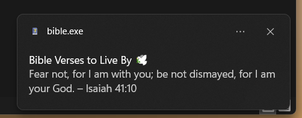

# Bible Verse Notifier

This Python program sends random Bible verses as notifications to your desktop.


## Features

- Randomly selects a Bible verse from a predefined list.
- Sends the verse as a desktop notification.

## Requirements

- Python 3.x
- `win10toast` library for notifications

## Installation

1. Clone the repository:
   ```bash
   git clone https://github.com/Yawlf/Verse-Alert.git
